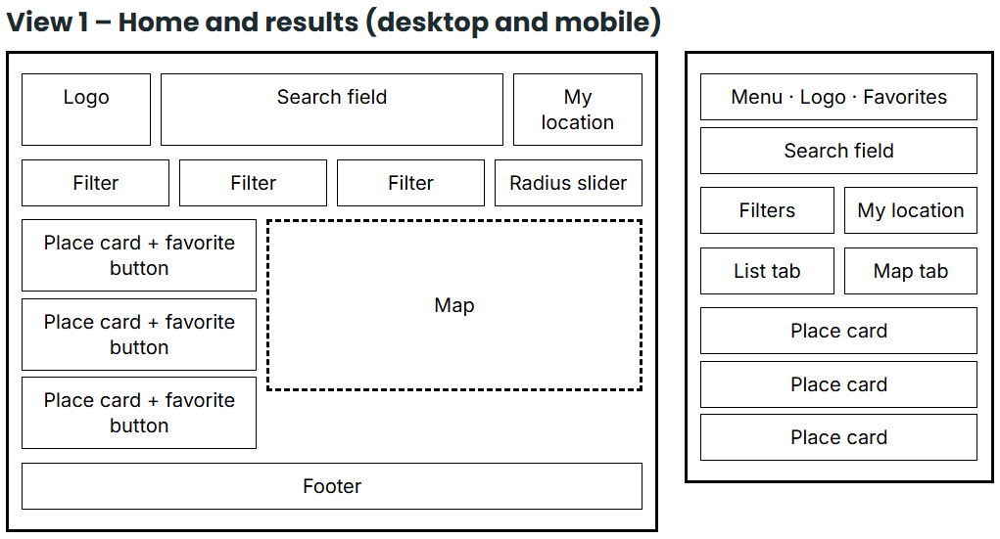
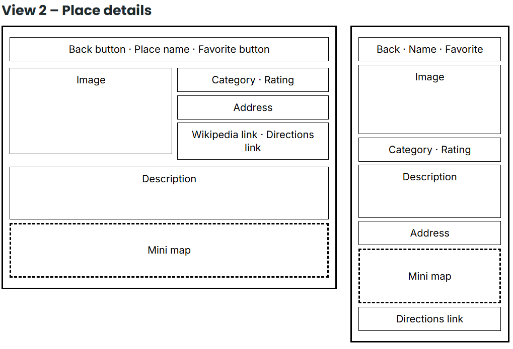
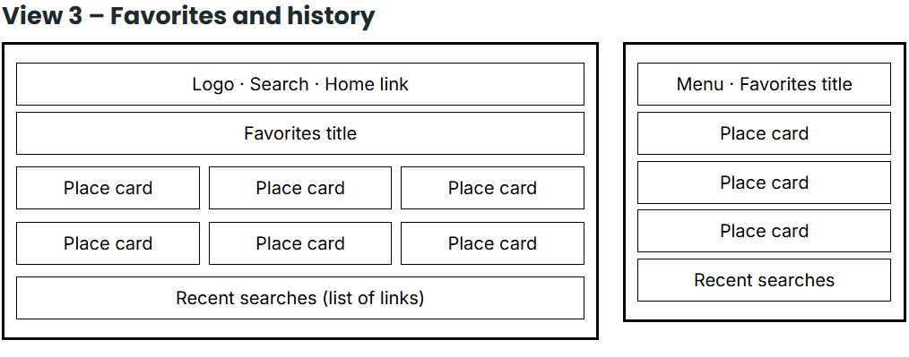

# Places to Visit Guide — Project Proposal (v2 · updated APIs)

**Course:** WDD330 · **Author:** Erick Scala

> v2 replaces OpenStreetMap/Nominatim tiles + OpenTripMap with
> Geoapify (geocoding, key), Wikipedia (places + details, no key)
> and Esri (tiles, no key). Verified working Oct 2026.

## 1. General Description

**Problem:** When planning a trip, it can be difficult to discover what is near
a destination, filter results by place type, and view locations on a map all in
one place.

**Solution:** "Places to Visit Guide" is a web application where users enter a
city or address (or use their current location) to get a list and an
interactive map of nearby tourist attractions.

**Motivation:** I am passionate about traveling and discovering
off-the-beaten-path locations, and I have always found it challenging to
find—in a single place—what to visit at a destination and where those spots
are located. Additionally, this project is an ideal opportunity to strengthen
a skill I have not yet mastered: consuming REST APIs.

## 2. Target Audience

- Travelers and tourists wishing to discover places to visit in a new destination.
- Families and groups planning weekend outings in their local area.
- Students and budget-conscious travelers looking for free options that do not
  require creating an account.
- Mobile users checking the guide while exploring the city.

## 3. Major Functions

| N° | Feature | Description |
|----|---------|-------------|
| 1 | Location search | Search field for a city, country, or address. Uses **Geoapify Geocoding** (`/v1/geocode/search?text=...&apiKey=...`) to convert the text into coordinates (the first result is used). The search runs when the user presses Enter or the search button. |
| 2 | Interactive map | Map (**Leaflet** + **Esri World Street Map** tiles, URL order `{z}/{y}/{x}`) centered on the destination, with a marker for each point of interest and the required `© Esri` attribution credit. |
| 3 | Attractions list | Cards showing name, category, distance to the center (computed locally with haversine), and popularity. Data from **Wikipedia Geosearch** (`list=geosearch`). Clicking a card highlights its corresponding marker. |
| 4 | Category filter | Buttons/chips to filter by: museums, architecture, nature, religion, history, entertainment (mapped to Wikipedia search terms/categories client-side). |
| 5 | Place details | Modal view or page featuring an image (`pageimages`), description (`extracts`), coordinates, Wikipedia link, and a "get directions" button (Google Maps/Esri directions link). Data from **Wikipedia API** (`prop=pageimages\|extracts\|coordinates`). |
| 6 | Favorites | Save/remove places using a heart icon. Stored in localStorage with a dedicated view. |
| 7 | Use my location | Button using the browser's Geolocation API to search for attractions near the user. |
| 8 | Error and state handling | Loading indicators; messages for no results, connection issues, or API limit reached (e.g. Geoapify daily quota). |

## 4. Wireframes

Recovered from v1 (unchanged layout, now backed by Geoapify + Wikipedia + Esri instead of Nominatim + OpenTripMap + OSM tiles).

### View 1 — Home and results (desktop and mobile)

### View 2 — Place details

### View 3 — Favorites and history

## 5. External Data

| Source | Purpose | URL | Requires API key? |
|--------|---------|-----|-------------------|
| Geoapify Geocoding | Geocoding: converts a typed city or address into latitude/longitude and returns the formatted address. Free plan: 3000 requests/day. | `https://api.geoapify.com/v1/geocode/search` (docs: `https://apidocs.geoapify.com/docs/geocoding/forward-geocoding/`, key at `https://myprojects.geoapify.com`) | **Yes** |
| Wikipedia API | Retrieves nearby places (`list=geosearch`, 5 km radius) and the details of each one (`prop=pageimages\|extracts\|coordinates`: image, summary, Wikipedia link). | `https://en.wikipedia.org/w/api.php` | No |
| Esri World Street Map | Map tiles (`.../MapServer/tile/{z}/{y}/{x}`). Free, no key; attribution required. | `https://server.arcgisonline.com/ArcGIS/rest/services/World_Street_Map/MapServer/tile/{z}/{y}/{x}` | No |
| Leaflet | Map rendering and markers (a mapping library, not a data API). | `https://leafletjs.com/` | No |

Removed: OpenStreetMap Nominatim + OSM tiles (blocked/unusable), OpenTripMap
(dead/scam docs), CARTO basemaps (now requires API key), Open-Meteo (replaced
by Geoapify per key requirement).

Data to store (localStorage):

- `favorites`: array of saved places (pageid, name, category, coordinates, image).
- Geoapify key: hardcoded in `js/api.mjs` (educational project, public teaching key).

## 6. Module List

| Module | Responsibility |
|--------|----------------|
| `api.mjs` | Geoapify geocode request, Wikipedia geosearch + details requests, and error handling (quota/empty results). No `xid` logic anymore. |
| `map.mjs` | Initializes Leaflet with Esri tiles (`{z}/{y}/{x}` order), adds/removes markers, syncs the map with the list. |
| `ui.mjs` | Renders cards, detail modal, filter chips, loaders, and messages. Computes distance (haversine) locally. |
| `storage.mjs` | Reads/writes favorites in localStorage (keyed by Wikipedia `pageid`). |
| `main.mjs` | Entry point: wires up events, handles geolocation, and switches between views. |

## 7. Graphic Identity

(unchanged — see v1 PDF)

- Primary Teal `#0F6B6B`, accent Orange `#E8743B`, background White `#FFFFFF`, text Dark gray `#1F2A2E`.
- Inter 400/500, fallback system-ui, sans-serif.
- Cards 10 px rounded corners; orange CTAs; teal active chips; heart icon for favorites.

## 8. Timeline (Weeks 5–7)

| Week | Focus | Deliverables |
|------|-------|--------------|
| 5 | Foundation and data | Project structure and repository; basic responsive HTML/CSS; **Geoapify API key**; city search with Geoapify; list of attractions from Wikipedia Geosearch. |
| 6 | Map and interaction | Leaflet map with **Esri tiles** + markers synced to the list; category filter; place detail view (Wikipedia image/summary); loading and error messages. |
| 7 | Persistence and polish | Favorites with localStorage (by `pageid`) and favorites view; “Use my location” button; final styling and basic accessibility; testing on mobile and desktop; deployment on GitHub Pages; final presentation. |

## 9. Project Planning (Trello)

Board link: https://trello.com/b/bGgvGUAd/places-visit-guide

To Do (updated):

- [x] Get **Geoapify** API key (replaces OpenTripMap/Open-Meteo) — obtained, hardcoded in `js/api.mjs`
- Test endpoints (Geoapify geocode, Wikipedia geosearch+details, Esri tiles)
- Create repository and folder structure
- Define color palette and typography in CSS
- Leaflet map + Esri markers
- Category filter (Wikipedia-based)
- Place detail view (Wikipedia image/summary)
- Favorites with localStorage (by `pageid`)
- Geolocation
- Mobile testing
- Deploy to GitHub Pages

Bugs / Improvements
- (To be filled in during development)

## 10. Challenges

- **API limits and keys:** Geoapify free plan is 3000 requests/day with API key
  (hardcoded in `js/api.mjs` — educational project). Wikipedia and Esri need no key but have fair-use limits: search
  only runs on Enter/button click and shows clear messages if a limit is reached.
- **Tile URL order:** Esri uses `{z}/{y}/{x}` (not OSM's `{z}/{x}/{y}`) —
  wrong order shows wrong map areas.
- **Incomplete data:** many Wikipedia places lack images or summaries, so
  default values and layouts that do not break are required (same as v1).
- **Syncing map and list:** keeping markers, cards, and filters consistent when
  the search or filter changes.
- **Asynchronous flow and errors:** chaining two APIs (geocode first, then
  Wikipedia geosearch) with async/await and handling network failures.
